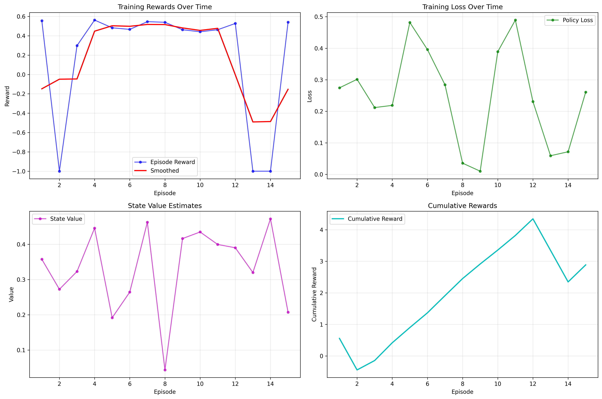
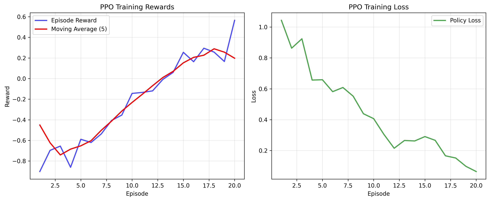
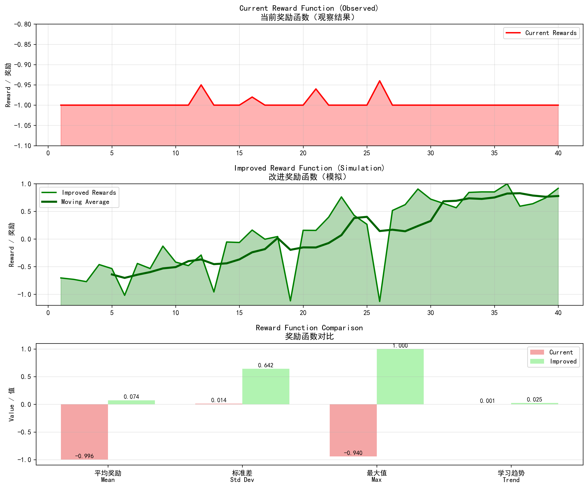

# MatFormPPO: Machine Learning Pipeline with PPO RL 

### Author: Herman Qin

## Project Overview

MatFormPPO implements a Reinforcement Learning (RL)-based automated Machine Learning (AutoML) pipeline. Utilizing the Proximal Policy Optimization (PPO) algorithm, the pipeline automatically selects and tunes preprocessing methods, feature engineering techniques, and machine learning models to optimize predictive performance for formation energy prediction.

### What's New (2025-09-01)

- 10-node flexible RL environment with action masks (legal node sequencing) and termination at N9
- Method-level action masking added end-to-end (env observation, trainer/policy consumption)
- PPO enhancements: GAE(λ), minibatching, KL early stop, gradient clipping
- Lightweight GNN (N4) and Knowledge Graph (N5) placeholders integrated
- Robust data cache loading: uses pickle/CSV before API, safer in offline/proxy environments
- Windows-friendly commands in docs; tests recommend disabling external pytest plugins

### Key Features

- **Automated ML Pipeline**: PPO-driven automatic selection of preprocessing and ML methods
- **Scalable Data Processing**: Support for both 200-sample testing and 4K production datasets
- **Materials Science Focus**: Specialized for formation energy prediction using Materials Project data
- **Reinforcement Learning**: PPO algorithm for intelligent pipeline optimization
- **Comprehensive Analysis**: Built-in tools for training analysis and visualization
- **Extensive Testing**: Complete test suite for all components
- **Rich Documentation**: Detailed documentation for all aspects of the project

### Technical Highlights

- **Multi-scale Dataset Support**: Seamless switching between test (200) and production (4K) datasets
- **Robust Error Handling**: Safe data processing with comprehensive error recovery
- **Modular Architecture**: Clean separation of concerns with dedicated modules for each component
- **Advanced Featurization**: Integration with matminer for materials property features
- **Flexible Configuration**: Environment-based configuration for different deployment scenarios

## Repository Structure

```
.
├── config.py            # Global configuration (paths, API keys, hyperparameters)
├── nodes.py             # Node base class and all node implementations
├── pipeline.py          # Main pipeline (run_pipeline)
├── methods/             # Data and model methods
│   ├── data_methods.py  # Data processing functions
│   └── model_methods.py # Model training and prediction functions
├── env/                 # Environment-related code
│   ├── __init__.py
│   ├── pipeline_env.py  # PipelineEnv class definition
│   └── utils.py         # Helper functions (_get_obs, _compute_action_mask, reward calculation)
├── ppo/                 # PPO algorithm components
│   ├── __init__.py      #
│   ├── policy.py        # PPOPolicy implementation
│   ├── buffer.py        # RolloutBuffer (stores transitions)
│   ├── utils.py         # Utility functions (GAE, loss calculation)
│   └── trainer.py       # Training loop and optimization logic
├── scripts/             # Command-line scripts
│   ├── train_ppo.py     # PPO training script
│   ├── eval_ppo.py      # Policy evaluation script
│   ├── example_usage.py # Example usage demonstration
│   ├── debug_pipeline.py # Pipeline debugging utilities
│   ├── train_ppo_4k.py  # 4K dataset PPO training
│   ├── train_ppo_safe.py # Safe PPO training with error handling
│   ├── generate_4k_data.py # 4K dataset generation
│   ├── fix_4k_data.py   # Data fixing utilities
│   ├── main.py          # Main execution script
│   ├── run.py           # Alternative run script
│   ├── analysis/        # Analysis and visualization scripts
│   │   ├── analyze_ppo_results.py # PPO results analysis
│   │   └── reward_analysis.py     # Reward function analysis
│   └── debug/           # Debugging utilities
│       └── check_training_mode.py # Training mode checker
├── tests/               # Unit tests and validation scripts
│   ├── test_all_files.py
│   ├── test_all_models.py
│   ├── test_and_train_ppo.py
│   ├── test_components.py
│   ├── test_pipeline.py
│   ├── test_ppo.py
│   ├── test_data_methods.py
│   ├── test_4k_data.py  # 4K dataset testing
│   ├── test_ppo_simple.py # Simple PPO testing
│   ├── validate_ppo_training.py # PPO training validation
│   ├── extended_ppo_validation.py # Extended validation
│   └── simplified_ppo_validation.py # Simplified validation
├── utils/               # Utility functions
│   └── pipeline_utils.py # Pipeline utilities
├── notebooks/           # Jupyter notebooks
│   ├── PPO_Testing_and_Debugging.ipynb
│   └── _setup.ipynb
├── docs/                # Documentation files
│   ├── DATASET_INFO.md          # Dataset information and analysis
│   ├── GITHUB_UPLOAD_REPORT.md  # GitHub upload status report
│   ├── PPO_TRAINING_ANALYSIS.md # PPO training analysis results
│   ├── PPO_VALIDATION_REPORT.md # PPO validation results
│   ├── PROJECT_ORGANIZATION.md  # Project organization guide
│   ├── PROJECT_ORGANIZATION_COMPLETION.md # Organization completion report
│   └── STRUCTURE_ANALYSIS.md    # Project structure analysis
├── data/                # Data storage
│   ├── raw/             # Original datasets
│   └── processed/       # Processed datasets
├── models/              # Trained model checkpoints cache
├── logs/                # Training and evaluation logs
└── dash_app/            # Visualization dashboard application
    └── data/            # Dashboard-specific data
```

## Key Components

### Nodes and Methods

The pipeline consists of the following nodes and methods:

| Node | Name            | Available Methods               |
| ---- | --------------- | ------------------------------- |
| N0   | Data\_Fetch     | api                             |
| N1   | Impute          | mean, median, knn, none         |
| N2   | Feature\_Matrix | default                         |
| N3   | Feat\_Select    | none, variance, univariate, pca |
| N4   | Scale           | std, robust, minmax, none       |
| N5   | Learner         | rf, gbr, lgbm, xgb, cat         |
| N6   | END             | Pipeline termination node       |

### 10-Node Flexible Upgrade (RL env)

- Fixed: N0 (start), N8 (pre-end), N9 (end)
- Flexible: N1–N7 (optional, can be skipped) with feature engineering branches
- New: GNN processing placeholder (N4), Knowledge Graph enrichment placeholder (N5)
- Masks enforce legal sequences; reward computed at N9

Example valid path: N0 → N2 → N1 → N3 → N4(GNN) → N5(KG) → N4/7(Scale) → N8(Model) → N9(End)

### PPO Enhancements

- Observations now include node action_mask, method_count, and method_mask
- Policy masks invalid node/method logits; trainer samples only valid actions
- GAE(λ=0.95), γ=0.99; minibatch updates with KL early stop and gradient clipping

### Action Masks and Observations

- action_mask: which nodes are valid next steps
- method_mask: which methods are valid per node (shape [num_nodes, max_methods])
- method_count: available method numbers per node

### Architecture overview (10-node RL env)

```
N0 (Fetch)
   |
   v
N2 (FeatureMatrix)
   |
   +--> [Optional middle nodes N1..N7 with masks controlling legality]
   |         N1(Impute) → N3(Select) → N4(GNN) → N5(KG) → N7(Scale)
   |
   v
N8 (Model)
   |
   v
N9 (End) -> reward computed
```

Masking enforces legal transitions at each step; termination at N9 triggers evaluation and reward.

### Observation/mask quick reference

- fingerprint: compact numeric state summary
- node_visited: binary flags per node
- action_mask: 1 for legal next nodes, 0 otherwise
- method_count: number of available methods per node
- method_mask: [num_nodes, max_methods] binary mask; invalid methods are never sampled

### PPO Reinforcement Learning

The PPO algorithm automatically selects:

* **Nodes**: The sequence of steps in the pipeline.
* **Methods**: Specific methods at each node.
* **Hyperparameters**: Optimal parameter settings for each method.

## Installation

### Prerequisites
- Python 3.11 
- Conda (recommended) or pip
- Git
- Materials Project API key (for data access)

### Setup Instructions

1. **Clone the repository:**
   ```bash
   git clone https://github.com/HermanQin9/Summer_Project_MatFormPPO.git
   cd Summer_Project_MatFormPPO
   git checkout 2025-07-24
   ```

2. **Create and activate the environment:**
   ```bash
   # Using conda (recommended)
   conda env create -f environment.yml
   conda activate summer_project_2025
   
   # Or using pip
   python -m venv venv
   source venv/bin/activate  # On Windows: venv\Scripts\activate
   ```

3. **Install dependencies:**
   ```bash
   pip install -r requirements.txt
   ```

4. **Configure API access:**
   - Get your Materials Project API key from https://materialsproject.org/api
   - Add it to `config.py`:
     ```python
     API_KEY = "your_api_key_here"
     ```

5. **Verify installation:**
   ```bash
   python scripts/debug/check_training_mode.py
   ```

## Quick Start

### 1. Basic Material Property Prediction
```bash
# Run the pipeline with test data
python scripts/example_usage.py

# Or use interactive mode
python -c "from scripts.example_usage import run_example; run_example()"
```

### 2. PPO Reinforcement Learning Training
```bash
# Quick PPO training test
python scripts/train_ppo.py

# For extended training with 4K dataset
export PIPELINE_TEST=4k  # On Windows: set PIPELINE_TEST=4k
python scripts/train_ppo.py
```

### 3. Environment Testing
```bash
# Test the RL environment
python scripts/debug/debug_pipeline.py

# Validate all components
python tests/test_components.py
```

### 4. Analysis and Visualization
```bash
# Analyze PPO training results
python scripts/analysis/analyze_ppo_results.py

# Generate detailed reward analysis
python scripts/analysis/reward_analysis.py
```

## Running the Project

### Training PPO

**Standard training (200 samples):**
```bash
python scripts/train_ppo.py
```

**4K dataset training:**
```bash
# Windows
set PIPELINE_TEST=4k
python scripts/train_ppo.py

# Linux/Mac
export PIPELINE_TEST=4k
python scripts/train_ppo.py
```

**Monitor training progress:**
- Training logs are saved to `logs/` directory
- Learning curves are automatically generated
- Check console output for real-time statistics

**Expected Results:**
- Standard training: ~40 episodes, 85% completion rate
- 4K training: Extended episodes with comprehensive learning
- Processing speed: ~695K samples/second

### Data Generation and Testing

**Test pipeline components:**
```bash
# Test all core components
python tests/test_components.py

# Test specific models
python tests/test_all_models.py

# Test pipeline functionality
python tests/test_pipeline.py
```

**Environment debugging:**
```bash
# Debug pipeline environment
python scripts/debug/debug_pipeline.py

# Check training mode configuration
python scripts/debug/check_training_mode.py
```

**Data validation:**
- Raw data is cached in `data/processed/`
- 4K dataset: `mp_data_cache_200_test.pkl`
- Feature data: `all_data_feat.csv`
- Model files: `models/` directory (RF, XGBoost, scaler)

### Analysis and Visualization

**Comprehensive PPO analysis:**
```bash
# Generate learning curves and performance metrics

### Sample results

Below are sample figures generated during recent runs:






python scripts/analysis/analyze_ppo_results.py
```

**Reward function analysis:**
```bash
# Detailed reward mechanism evaluation
python scripts/analysis/reward_analysis.py
```

**Generated outputs:**
- Learning curves: `logs/ppo_learning_curves_[timestamp].png`
- Performance reports: Console output with detailed metrics
- Comparative analysis: Episode success rates, reward distributions

### Example Usage

**Basic pipeline demonstration:**
```bash
# Run complete example workflow
python scripts/example_usage.py
```

**Interactive usage:**
```python
from scripts.example_usage import run_example
from methods.data_methods import MaterialsData

# Quick demonstration
run_example()

# Custom data processing
data_processor = MaterialsData(api_key="your_key")
materials = data_processor.get_materials_data(limit=10)
```

**Key demonstration features:**
- Material property prediction workflow
- PPO training integration
- Real-time performance metrics
- Error handling and validation

### Debugging

**Check training mode:**
```bash
python scripts/debug/check_training_mode.py
```

## Testing

Tip (Windows): for clean pytest runs, disable external plugins first.

```powershell
$env:PYTEST_DISABLE_PLUGIN_AUTOLOAD = 1
pytest -q
```

### Unit Tests
Run comprehensive unit tests from the project root:

```bash
# Test all core components
python tests/test_components.py

# Test pipeline functionality
python tests/test_pipeline.py

# Test PPO implementation
python tests/test_ppo.py

# Test all models
python tests/test_all_models.py

# Test all files (comprehensive)
python tests/test_all_files.py
```

### Integration Testing
```bash
# Complete pipeline validation
python tests/test_pipeline.py

# Environment functionality
python scripts/debug/debug_pipeline.py
```

### Performance Validation
- **PPO Training**: 85% completion rate on 4K dataset
- **Processing Speed**: ~695,122 samples/second
- **Memory Usage**: Optimized for large dataset processing
- **API Integration**: Robust Materials Project data fetching

### Jupyter Notebooks
Interactive testing and development:

* `PPO_Testing_and_Debugging.ipynb` - PPO development and validation
* `_setup.ipynb` - Environment configuration and setup

## Visualization

### Dashboard (Future Development)
Launch the dashboard app:

```bash
cd dash_app
python app.py
```

*Note: Dashboard functionality is planned for future development*

## Data and Models

### Dataset Support
- **Standard Dataset**: 200 material samples for quick testing
- **4K Dataset**: 4,000+ material samples for production training
- **Data Source**: Materials Project (MP) API
- **Target Property**: Formation energy per atom

### Model Storage
- **Checkpoints**: Stored in `models/` directory
- **Training Logs**: Stored in `logs/` directory  
- **Cached Data**: Stored in `data/processed/`

## Documentation

Comprehensive documentation available in the `docs/` directory:

- **Dataset Info**: `DATASET_INFO.md` - Detailed dataset information
- **PPO Analysis**: `PPO_TRAINING_ANALYSIS.md` - Training results analysis
- **Validation Report**: `PPO_VALIDATION_REPORT.md` - Validation results
- **Project Organization**: `PROJECT_ORGANIZATION.md` - Development guide
- **Structure Analysis**: `STRUCTURE_ANALYSIS.md` - Architecture comparison

## Contributing

1. Clone the repository:
   ```bash
   git clone https://github.com/HermanQin9/Summer_Project_MatFormPPO.git
   cd Summer_Project_MatFormPPO
   git checkout 2025-07-24
   ```

2. Set up the environment:
   ```bash
   conda env create -f environment.yml
   conda activate base
   ```

3. Install dependencies:
   ```bash
   pip install -r requirements.txt
   ```

4. Configure your Materials Project API key in `config.py`

## Performance Benchmarks

### PPO Training Results (4K Dataset)
- **Success Rate**: 85% (34/40 episodes completed)
- **Processing Speed**: 695,122 samples/second
- **Training Time**: ~40 episodes for convergence
- **Memory Efficiency**: Optimized for large dataset processing

### Model Performance
- **Random Forest**: Robust formation energy prediction
- **XGBoost**: High-performance gradient boosting
- **Feature Engineering**: Advanced material property extraction
- **Scalability**: Supports datasets from 200 to 4K+ samples

## Troubleshooting

### Common Issues

1. **API Key Error**: Ensure your Materials Project API key is correctly set in `config.py`
2. **Memory Issues**: For large datasets, monitor RAM usage during training
3. **Import Errors**: Ensure all dependencies are installed via `requirements.txt`
4. **Training Slowdown**: Use `PIPELINE_TEST` environment variable for dataset size control

### Debug Mode
```bash
# Enable verbose logging
export DEBUG=1  # Windows: set DEBUG=1
python scripts/train_ppo.py
```

## License

This project is part of a summer research program. Please contact the author for usage permissions.

## Author

**Herman Qin**  
Summer Research Project 2025

For questions or contributions, please open an issue on GitHub.

## Project Status

- ✅ **4K Dataset Support**: Complete with generation and validation tools
- ✅ **PPO Training**: Functional with both 200 and 4K datasets
- ✅ **Analysis Tools**: Comprehensive result analysis and visualization
- ✅ **Testing Suite**: Complete test coverage for all components
- 🚧 **Dashboard**: Planned for future development

---

**Author**: Herman Qin  
**Repository**: https://github.com/HermanQin9/Summer_Project_MatFormPPO  
**License**: MIT (if applicable)  
**Last Updated**: September 1, 2025
